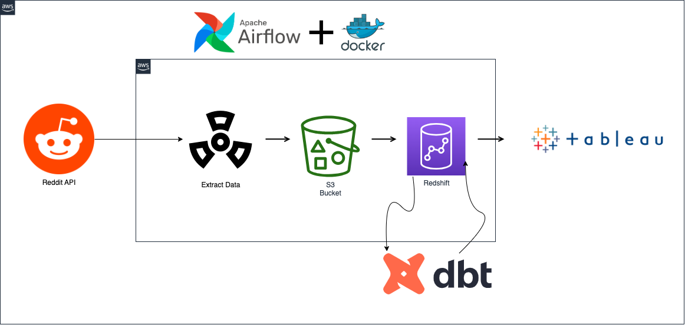

# Building a Reddit-ETL-Pipeline wtih Terraform, Airflow, Docker, and  dbt.

## Overview
This project is a proof of concept for building a data pipeline using Terraform, Airflow, Docker, and dbt. The pipeline will extract data from the Reddit API, transform the data using dbt, and load the data into a Redshift Datawarehouse. The pipeline will be deployed to AWS using Terraform and Docker, and monitored using Airflow. The data will be visualized using Tableau, or Google Data Studio.

---
## Architecture



---
## Flow
1. Extract data using [Reddit API](https://www.reddit.com/dev/api/)
1. Load into [AWS S3](https://aws.amazon.com/s3/)
1. Copy into [AWS Redshift](https://aws.amazon.com/redshift/)
1. Transform using [dbt](https://www.getdbt.com)
1. Create [Tableau](https://www.tableau.com) Dashboard or [Google Data Studio](https://datastudio.google.com) Report.
1. Orchestrate with [Airflow](https://airflow.apache.org) in [Docker](https://www.docker.com)
1. Create AWS resources with [Terraform](https://www.terraform.io)
---

## Software Used in the Project

| Software             | Version                                      |
|----------------------|----------------------------------------------|
| Visual Studio Code   | [1.78.2](https://code.visualstudio.com/)     |
| Apache Airflow       | [2.3.2](https://airflow.apache.org/docs/)    |
| Terraform            | [1.4.6](https://www.terraform.io/docs/index.html) |
| Docker               | [4.19.0](https://www.docker.com/get-started) |
| dbt (Data Build Tool)| [dbt cloud](https://www.getdbt.com/)           |

---
## Terraform
### Installation
First, install the HashiCorp tap, a repository of all our Homebrew packages.

```
$ brew tap hashicorp/tap
```

Now, install Terraform with `hashicorp/tap/terraform`.

```
$ brew install hashicorp/tap/terraform
```

```
$ brew update
```

Then, run the `upgrade` command to download and use the latest Terraform version.

```
$ brew upgrade hashicorp/tap/terraform==> Upgrading 1 outdated package:
hashicorp/tap/terraform 0.15.3 -> 1.0.0
==> Upgrading hashicorp/tap/terraform 0.15.3 -> 1.0.0

```

### **Verify the installation**

Verify that the installation worked by opening a new terminal session and listing Terraform's available subcommands.

```
$ terraform -helpUsage: terraform [-version] [-help] <command> [args]

The available commands for execution are listed below.
The most common, useful commands are shown first, followed by
less common or more advanced commands. If you're just getting
started with Terraform, stick with the common commands. For the
other commands, please read the help and docs before usage.
##...
```

Add any subcommand to `terraform -help` to learn more about what it does and available options.

```
$ terraform -help plan
```

## Starting Services
- Navigate to the `airflow` directory:
- Rum  `airflow-init` to initialize the database and create the airflow user.
- Run the following command to start the services:
~~~
docker compose up -d
~~~

## Why do we need an ETL pipeline?

Assume we had a set of data that we wanted to use. However, this data is unclean, missing information, and inconsistent as with most data. One solution would be to have a program clean and transform this data so that:

- There is no missing information
- Data is consistent
- Data is fast to load into another program
- With smart devices, online communities, and E-Commerce, there is an abundance of raw, unfiltered data in today’s industry.
- However, most of it is squandered because it is difficult to interpret due to it being tangled. ETL pipelines are available to combat this by automating data collection and transformation so that analysts can use them for business insights.


